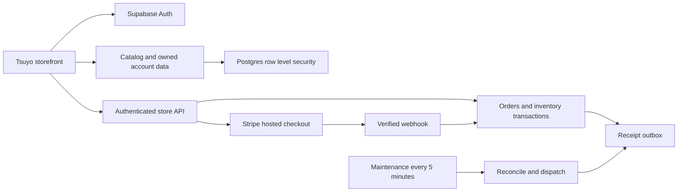

# Tsuyo backend

The storefront is connected to the Supabase **E-commerce** project (`bhodifcqtkajjojvuqtk`). The schema, image bucket, three Edge Functions, and maintenance schedule are deployed. Prices use MYR in integer minor units.

The production storefront is [tsuyo.vercel.app](https://tsuyo.vercel.app). Supabase Auth uses this as its site URL, with exact account and recovery callbacks. `STORE_URL` and `STORE_ALLOWED_ORIGINS` include the production address; localhost and the existing LAN development origin remain supported.

## Current store state

- The original four products are drafts with twenty size variants, illustrative prices, and zero stock. The design preview remains visible while the catalog is prepared.
- Real checkout is closed; sample shopping bags can use an isolated sandbox flow. Stripe test credentials and the signed webhook are configured; a real sandbox payment of RM 129 was verified. No real money was charged. See [STRIPE.md](STRIPE.md) for the customer journey and verification scope.
- Delivery supports Malaysia and international country/region zones. No delivery zone is enabled; fees and free-delivery thresholds await your configuration.
- A private owner invitation was created for the email you specified. Create and confirm that account, then sign in. The invitation is accepted once against the verified Supabase account and expires after seven days.
- Transactional messages remain in an outbox until a sender is configured. Marketing campaigns are not sent by this implementation.

## Included

| Area | Backend and interface |
| --- | --- |
| Catalog | Products, draft/active/archive states, sizes, unique SKUs, per-size prices, image uploads |
| Inventory | On-hand/reserved quantities, stock adjustments with reasons, sale ledger, checkout reservations |
| Customers | Supabase email/password auth, confirmation, password recovery, profiles, addresses, order history |
| Shopping | Guest browser bag and wishlist; authenticated database bag and wishlist |
| Checkout | Guest and account checkout, server pricing, coupons, regional delivery, Stripe-hosted card payment |
| Orders | Immutable line-item/address snapshots, payment status, delivery stages, carrier/tracking, audit events |
| Payments | Signed Stripe events, idempotent payment recording, reconciliation, partial/full refund support |
| Communications | Newsletter consent/unsubscribe API; queued order and shipment receipts |
| Management | Protected products, SKU/stock, orders, delivery zones, promo codes and settings at `/admin` |



## Start and verify

```sh
npm install
npm run dev
npm test
npm run build
npm run verify:live
```

The app reads the project URL and public publishable key from `.env.local` in development and Vercel's production environment at build time. Vercel linking may also write a private CLI OIDC token into the ignored `.env.local`; keep that file private and out of deployment uploads. `.env.example` is the portable template. Never put a service key or Stripe secret in a `VITE_` variable.

The project is linked through the authenticated Supabase CLI. Migrations were generated with the CLI, tested, applied to the initially empty database, and recorded in migration history. `supabase/config.toml` intentionally declares only the auth redirects and function auth settings; other remote settings are preserved.

## Open the store when ready

1. Create and verify your owner account at `/account?mode=signup`. Sign in and open `/admin`.
2. Replace illustrative descriptions/prices with confirmed merchandise. Mark it as real, activate it, and add stock through the inventory adjustment form.
3. Configure and enable the delivery zones, fees and optional free-delivery threshold. Use ISO country codes and region names. Region matching ignores capitalization and surrounding spaces.
4. Stripe sandbox setup is complete. For another environment, configure its secrets in Supabase Edge Function secrets: `STRIPE_SECRET_KEY` and `STRIPE_WEBHOOK_SECRET`. Use the deployed endpoint `https://bhodifcqtkajjojvuqtk.supabase.co/functions/v1/stripe-webhook` for `checkout.session.completed`, `checkout.session.expired`, `checkout.session.async_payment_succeeded`, `checkout.session.async_payment_failed`, and `charge.refunded`.
5. Test successful, declined, abandoned and duplicate-event payment flows before switching to live Stripe credentials. The successful isolated sandbox flow was executed; declined, authentication and normal inventory-backed customer flows still require testing. See STRIPE.md for exact evidence.
6. If using Stripe Tax, configure its settings, registrations and product classification. Checkout uses an immutable per-order customer delivery address for tax location. See [Stripe's Checkout tax documentation](https://docs.stripe.com/tax/checkout/page).
7. Configure production Auth SMTP for customer confirmations/recovery. To deliver queued receipts with Resend, set `RESEND_API_KEY` and a verified `STORE_FROM_EMAIL`. The jobs retry queued messages with an idempotency key. See [Resend's send-email API](https://resend.com/docs/api-reference/emails/send-email).
8. Publish final delivery/returns, privacy, terms and contact information before sales. Existing preview business policies are placeholders, not finalized commercial policies.
9. The current Vercel domain and client-route rewrite are configured. If the site moves to a custom domain, update `STORE_URL`, `STORE_ALLOWED_ORIGINS`, and the declared Auth site/callback URLs to that domain.
10. Enable checkout in store settings. The server requires payment/webhook configuration, an enabled delivery zone and real available inventory.

## Access and transaction rules

Every new exposed table has RLS. Public clients read active catalog data, public store settings and enabled delivery zones. Customer rows are restricted to their verified session identity. Staff authorization reads the private staff table, never user-editable metadata. Owner invitation acceptance also checks the actual verified Auth email.

Browsers cannot write order/payment state, stock balances, webhook events, newsletter lists, or the outbox directly. Sensitive commerce RPCs are service-role-only and use `SECURITY INVOKER`. The narrow private staff lookup/invitation helpers use a fixed empty search path and an explicit `auth.uid()` guard.

Checkout locks SKU rows in consistent order, calculates prices/discount/delivery from database values, and reserves stock atomically. Provider session creation uses stable idempotency keys. Paid events consume the reservation once. An order-success URL cannot prove payment. Stock is released only after a conclusive provider failure/expiry; uncertain provider states preserve it for reconciliation. Refunds do not automatically restock returned merchandise.

Guest order lookup requires a random token whose SHA-256 hash is stored in the order. The raw token stays in the checkout browser. Signed-in customers can read their own history. Image storage accepts only JPG, PNG, WebP and AVIF, up to 10 MB, and staff alone can upload/replace/remove product media.

## Server functions

- `store-api`: public quote/checkout/newsletter paths, verified customer order lookup, staff-only management actions. Exact origin allowlist and bounded JSON bodies.
- `stripe-webhook`: raw-body signature verification and transactional processing; failed writes return an error so Stripe retries.
- `store-jobs`: dedicated secret authentication, provider reconciliation, queued receipt dispatch and old rate-limit cleanup. Its secret is held in Supabase Vault and Edge secrets. Cron runs every five minutes; successful scheduled HTTP responses were verified.

Gateway JWT verification is disabled for these functions because guests, Stripe and the internal scheduler have different authentication contracts. Customer/staff tokens are verified in code, Stripe signatures are verified, and jobs require their dedicated secret. This does not grant anonymous access to management actions or private database rows.

## Verification evidence and limits

Nineteen local tests use an actual portable Postgres runtime for schema/RLS/transaction checks and the Stripe SDK for real signature-verification fixtures. They cover ownership/reassignment, metadata forgery, hidden drafts, client price tampering, quantities, reservations, duplicate payment events, overselling, stock ledger, fulfillment, owner invitation acceptance and regional delivery matching.

The deployed API was checked for public MYR settings, hidden drafts, inaccessible private orders, admin denial, validation, closed checkout, origin rejection, webhook configuration/signature gating and job authentication. An authenticated maintenance call returned success; scheduled calls returned HTTP 200. Supabase advisors returned no warnings after the fixes.

Browser checks cover the available public account/registration/recovery forms, protected management entry, the bag and closed checkout on desktop/mobile. Owner sign-in, authenticated management operations, real Stripe payments and email delivery still require live/provider setup; no claim is made that those external flows were exercised. No real orders, payments, email subscriptions or customer test accounts were created in the cloud verification.
